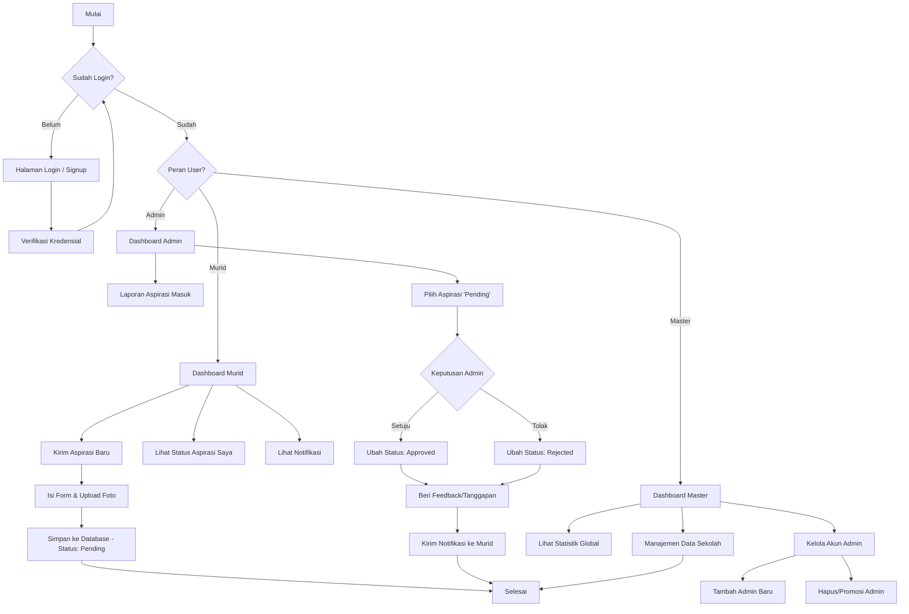

# Flowchart dan Alur Sistem - SAKTI

Dokumen ini menjelaskan alur kerja sistem SAKTI untuk tiga peran utama: Murid, Admin, dan Master.

---

## 1. Alur Pengguna (Flowchart)

Anda dapat menyalin kode Mermaid di bawah ini ke [Mermaid Live Editor](https://mermaid.live/) untuk menghasilkan gambar flowchart yang profesional.

---

## 2. Deskripsi Alur Kerja

### A. Alur Murid (Student Flow)
1. **Registrasi**: Murid mendaftar menggunakan NIS, Nama, email, dan password.
2. **Dashboard**: Menampilkan ringkasan jumlah aspirasi yang telah dikirim.
3. **Kirim Aspirasi**: Murid mengisi kategori (Fasilitas, Akademik, dll), judul, isi, lokasi, dan opsional foto.
4. **Tracking**: Murid dapat memantau apakah aspirasi mereka masih diproses (Pending), diterima (Approved), atau ditolak (Rejected).

### B. Alur Admin (Admin Flow)
1. **Verifikasi**: Admin meninjau aspirasi yang masuk dari murid.
2. **Manajemen Status**: Admin mengubah status aspirasi sesuai kebijakan sekolah.
3. **Feedback**: Admin memberikan penjelasan mengapa suatu aspirasi disetujui atau ditolak agar murid mendapatkan informasi yang jelas.

### C. Alur Master (Master Flow)
1. **Supervisi**: Memantau seluruh aktivitas sistem melalui dashboard statistik.
2. **Kontrol Akses**: Memiliki wewenang untuk menambahkan atau merubah peran pengguna lain menjadi Admin.
3. **Data Master**: Mengelola data dasar yang dibutuhkan oleh sistem.
